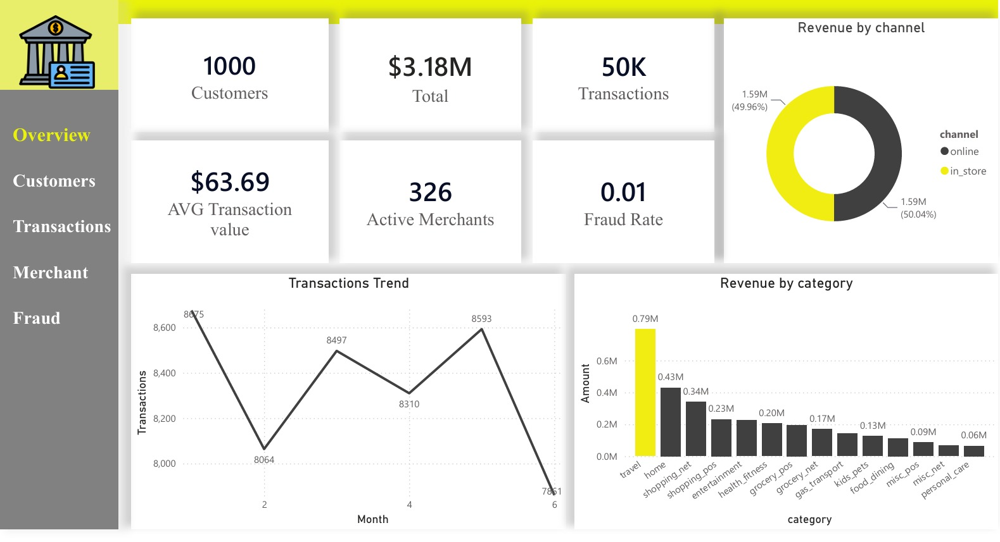
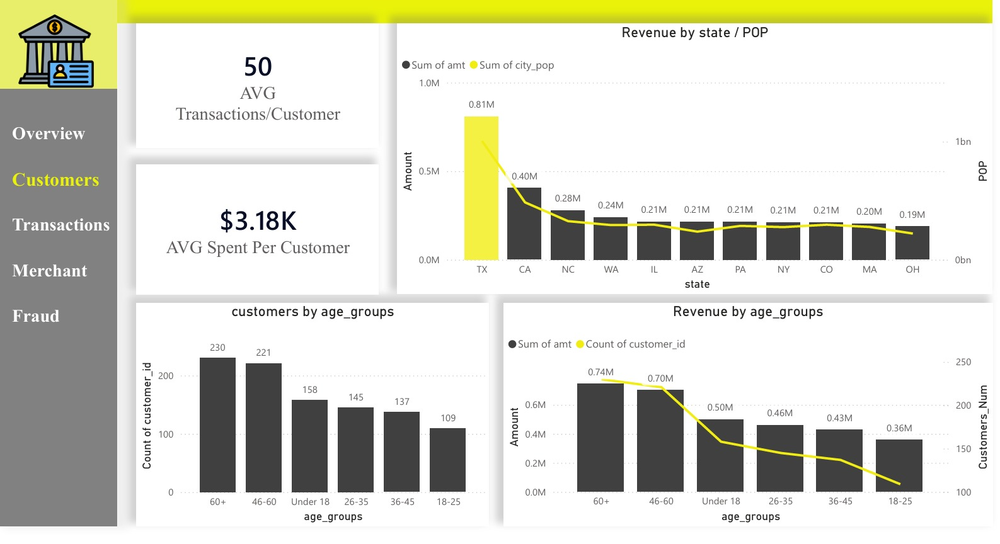
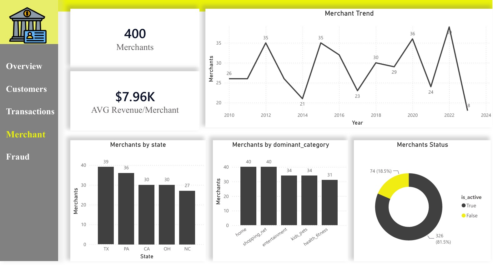
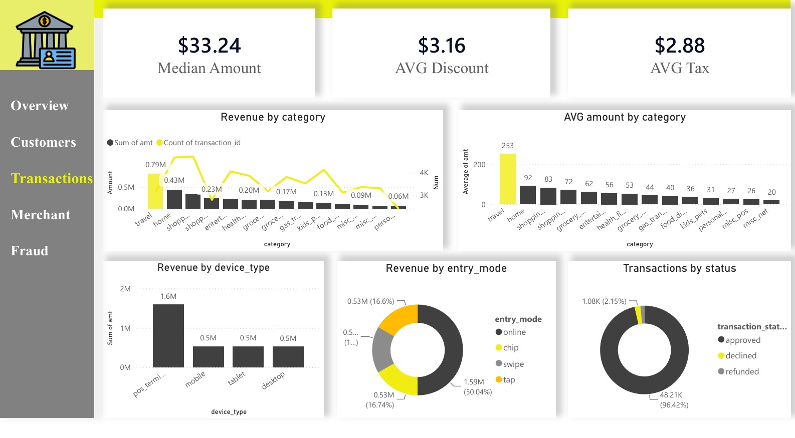
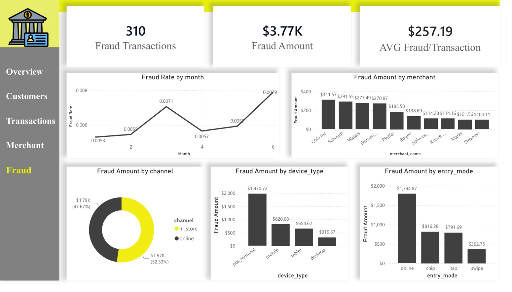

# Bank Card Transactions Analytics

## Project Overview

This project analyzes bank card transactions to understand overall transaction activity, customer behavior, merchant performance, transaction patterns, and fraud exposure.

The project covers the full data analysis workflow, starting from raw data quality checks and SQL transformations, followed by data warehouse modeling and finally an interactive Power BI report.

---

## Business Questions

The analysis was designed to answer questions such as:

* What is the overall volume and value of card transactions?
* Which customer segments show higher transaction value?
* How does transaction behavior vary across payment methods, channels, and devices?
* Which merchant categories and merchants contribute most to transaction value?
* Where is fraud exposure more noticeable?

---

## Project Workflow

**Raw Data → Data Quality → SQL Transformation → Data Warehouse → Power BI → Insights & Recommendations**

The data was processed using a three-layer architecture:

```text
Bronze
   ↓
Silver
   ↓
Gold
   ↓
Power BI
```

### Bronze Layer

The Bronze layer contains the raw data and the initial data quality assessment.

Checks included:

* Missing values
* Duplicate IDs
* Categorical value consistency
* Row counts
* Customer and merchant relationship validation

### Silver Layer

The Silver layer contains cleaned and transformed data.

Transformations included:

* Data type handling
* Age calculation
* Age group creation
* Year and month extraction
* Merchant name cleaning
* Handling missing values
* Preparing analytical fields

### Gold Layer

The Gold layer was designed as an analytics-ready **Star Schema**.

It includes:

* `DimCustomers`
* `DimMerchants`
* `DimDate`
* `FactTransaction`

The fact table is connected to the customer, merchant, and date dimensions using primary and foreign key relationships.

---

## Data Model

```text
                  DimCustomers
                       │
                       │
DimDate ─────── FactTransaction ─────── DimMerchants
```

This structure separates descriptive attributes from transaction-level measures and makes the data easier to analyze in Power BI.

---

## Power BI Dashboard

The Power BI report is organized into five pages, with each page focusing on a specific business question.

### 01 — Executive Overview

Provides a high-level view of the overall banking activity.

> What is the overall scale of transaction activity, and what does the business look like at a glance?



---

### 02 — Customer Insights

Focuses on customer characteristics, segmentation, and spending behavior.

> Who are the customers, and which segments show different levels of value?



---

### 03 — Merchant Performance

Analyzes merchant activity, categories, locations, and performance.

> Which merchants and categories contribute most to transaction activity?



---

### 04 — Transaction Analysis

Explores how customers make transactions across payment methods, channels, entry modes, and devices.

> How are transactions being made, and which transaction patterns stand out?



---

### 05 — Fraud Analytics

Provides a focused view of fraudulent transactions and their characteristics.

> Where is fraud exposure concentrated, and what transaction characteristics are associated with it?



---

## Key Insights

### 1. Transaction Value Distribution

The difference between average and median transaction value indicates that higher-value transactions have an effect on the overall average.

This shows why looking at both measures provides a better understanding of typical transaction behavior.

### 2. Customer Segmentation

Customer behavior differs across segments such as loyalty tiers and age groups.

This indicates that the customer base should not be treated as one homogeneous group when evaluating customer value and behavior.

### 3. Fraud Exposure

Fraud represents a relatively small share of total transactions, but fraudulent transactions can have a higher financial impact when their transaction values are considered.

This makes transaction value an important dimension when evaluating fraud exposure rather than relying only on fraud transaction counts.

---

## Recommendations

Based on the analysis:

* Use both average and median transaction values when monitoring transaction behavior.
* Segment customers based on their value and behavior to support more targeted strategies.
* Monitor high-value transactions as part of fraud risk analysis.
* Evaluate merchant performance from both business performance and risk perspectives.
* Continue monitoring transaction channels and payment behaviors to identify unusual patterns.

---

## Tools & Technologies

* **SQL Server** — Data quality checks, transformation, and data warehouse development
* **SQL** — Data preparation and analytical modeling
* **Power BI** — Data modeling, DAX, visualization, and dashboard development
* **Star Schema** — Analytical data warehouse design

---

## Repository Structure

```text
Bank-Card-Transactions-Analytics/
│
├── Data/
│   ├── Customers.csv
│   ├── Merchants.csv
│   └── Transactions.csv
│
├── SQL/
│   ├── 00_Database_Setup.sql
│   ├── 01_Bronze.sql
│   ├── 02_Silver.sql
│   └── 03_Gold.sql
│
├── PowerBI/
│   └── BankCard_Analytics.pbix
│
├── Dashboard/
│   ├── Overview.jpeg
│   ├── Customers.jpeg
│   ├── Transactions.jpeg
│   ├── Merchant.jpeg
│   └── Frauds.jpeg
│
└── Documentation/
```

---

## Project Takeaway

The main goal of this project was not only to build a dashboard, but to practice the complete process of turning raw transactional data into a structured analytical solution.

**Data Quality → SQL → Data Warehouse → Data Modeling → Power BI → Analysis → Insights → Recommendations**
